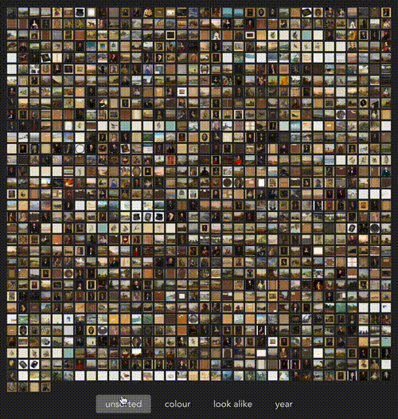

# Aereo

Code repository for [_Aereo_](https://dxlab.sl.nsw.gov.au/aereo/), an experimental bird’s eye view of the digital collections from the State Library of New South Wales by [Mauricio Giraldo Arteaga](https://github.com/mgiraldo/) for the [2019 DX Lab Fellowship](https://dxlab.sl.nsw.gov.au/blog/winner-dx-lab-fellowship-3).



## Related repositories

### Image analysis and machine learning

Used to create object predictions and obtain color palettes from the images:

https://github.com/mgiraldo/image-utils

### Category pixels and atlases

Used to create the category pixels (when thumbnails are off) and atlases  (when thumbnails are on):

https://github.com/mgiraldo/aereo-pixels


## Data download

To download these files you need to know how to use [Amazon S3](https://aws.amazon.com/s3/). The files are located in this bucket:

```
https://dxlab-fellowship-2019.s3.amazonaws.com/
```

All files are in their own subfolder in that bucket and <a href="https://dxlab-fellowship-2019.s3.amazonaws.com/csv/all.csv" target="_blank" rel="noopener">mapped in this CSV</a> (85 MB). The CSV has three columns: `id`, `filename`, `access_pid`. This is really one of the CSVs listed below in “File ID to URL mapping” that contains every file.

<table>
  <thead>
    <tr>
      <th>Name</th>
      <th>
        File count
      </th>
      <th>Size</th>
    </tr>
  </thead>
  <tbody>
    <tr>
      <td>File ID to URL mapping for categories/full set (CSV)</td>
      <td>22</td>
      <td>48.1 MB</td>
    </tr>
    <tr>
      <td>Colour summarizing (full version)</td>
      <td>2,212,318</td>
      <td>64.3 GB</td>
    </tr>
    <tr>
      <td>Colour summarizing (compact version)</td>
      <td>2,231,480</td>
      <td>1.3 GB</td>
    </tr>
    <tr>
      <td>Image predictions (4,096 word values, gzipped)</td>
      <td>2,231,222</td>
      <td>33.8 GB</td>
    </tr>
    <tr>
      <td>Image similarity intermediate data</td>
      <td>81</td>
      <td>2.9 GB</td>
    </tr>
    <tr>
      <td>Image thumbnails (150x150 pixels)</td>
      <td>2,231,496</td>
      <td>9.8 GB</td>
    </tr>
    <tr>
      <td>Image thumbnails (32x32 pixels)</td>
      <td>2,238,557</td>
      <td>3.5 GB</td>
    </tr>
  </tbody>
</table>

### Colour summaries

This is the color information extracted from every image like histogram, colour palette, and more. There are two versions: full and compact. The compact version is the one used by <em>Aereo</em> and only includes:

- the five more prominent colours (palette)
- percentage amount for each colour
- text names for each colour

The two groups of files are not consistently named (because long story 😳) and follow this structure:

#### Full version

<dl>
  <dt>Folder</dt>
  <dd><code>colors_output</code></dd>
  <dt>Type</dt>
  <dd>JSON</dd>
  <dt>Naming convention</dt>
  <dd>Based on the file <code>access_pid</code> (e.g.: <code>[BUCKET]/colors_output/110000148.json</code>).</dd>
</dl>

#### Compact version

<dl>
  <dt>Folder</dt>
  <dd><code>colors_minimal</code></dd>
  <dt>Type</dt>
  <dd>JSON</dd>
  <dt>Naming convention</dt>
  <dd>Based on the file <code>id</code> (e.g.: <code>[BUCKET]/colors_minimal/0A3Z4x84Z0wq.json</code>).</dd>
</dl>

### Image predictions

<dl>
  <dt>Folder</dt>
  <dd><code>predictions</code></dd>
  <dt>Type</dt>
  <dd>Gzipped JSON</dd>
  <dt>Naming convention</dt>
  <dd>Based on the file <code>id</code> (e.g.: <code>[BUCKET]/predictions/0A3Z4x84Z0wq.json.gz</code>).</dd>
</dl>

These are the object recognition predictions for every image. These are 4,096 newline-separated values from 0 to 1 saved as gzipped JSON but no real JSON structure is used.

### Image similarity

<dl>
  <dt>Folder</dt>
  <dd><code>similarities</code></dd>
  <dt>Type</dt>
  <dd>Multiple, see below</dd>
</dl>

These are the similarity calculations for each category of files in _Aereo_. The internal names of the categories are:

- `archTechDrawings`
- `newspapers`
- `coin`
- `drawings`
- `ephemera`
- `journals`
- `manuscripts`
- `manuscriptMaps`
- `maps`
- `medals`
- `negatives`
- `objects`
- `paintings`
- `photographs`
- `pictures`
- `posters`
- `prints`
- `stamps`

For each category there are **four files**: three [Python Pickle](https://docs.python.org/3/library/pickle.html) files and one text file. The Pickle files are the in-between steps for converting the 4,096 object recognitions above into the square grid that is used in _Aereo_. The code for this process is available in [this repository](https://github.com/mgiraldo/image-utils), where [this file](https://github.com/mgiraldo/image-utils/blob/master/similar_csv.py) is the one outputting the Pickle and text files.

#### Pickles

The process includes:

- converting the 4,096 down to the 300 most informative values via [Principal Component Analysis (PCA)](https://en.wikipedia.org/wiki/Principal_component_analysis). <br />Filename: `[CATEGORY]_pca.p` (e.g.: `[BUCKET]/similarities/prints_pca.p`);
- shaping those 300 into a three-dimensional space using [t-distributed Stochastic Neighbor Embedding (t-SNE)](https://en.wikipedia.org/wiki/T-distributed_stochastic_neighbor_embedding). I later replaced this with [Uniform Manifold Approximation and Projection (UMAP)](https://umap-learn.readthedocs.io/en/latest/) which is much faster (but kept the original t-SNE anyway). <br />Filename: `[CATEGORY]_[tsne or umap].p` (e.g.: `[BUCKET]/similarities/prints_umap.p`);
- converting the three-dimensional space into a two-dimensional grid using [RasterFairy](https://github.com/Quasimondo/RasterFairy) and producing a newline-separated list of `x y` coordinates for each file in the category and starting with a `COLUMNS ROWS` line. The `photographs` category wouldn't work in RasterFairy so it was gridded using [Lagrangian Gradient Descent](https://colab.research.google.com/drive/16-eM-t3ZevY72I1gBQUSnUZnFkL2GG0h#scrollTo=ROJMfqIzzSw2).<br />Filename: `[CATEGORY].txt` (e.g.: `[BUCKET]/similarities/prints.txt`)

### Image thumbnails

There are two folders, one with 150x150 pixel thumbnails (folder `150_150`) and one with 32x32 pixel thumbnails (folder `32_32`). Both have the same naming convention but the 32x32 has PNG files and the 150x150 has JPEG files (I have no good explanation for this difference 😳): `[first_four_characters_of_filename]/filename.[png or jpg]` (e.g.: `[BUCKET]/32_32/1000/10000130.png` and `[BUCKET]/150_150/1000/10000130.jpg`).

## Setup and running locally

See `.env.example` for the necessary environment variables and rename to `.env.local` for proper functioning in localhost.

### Project setup

```
yarn install
```

### Compiles and hot-reloads for development

```
yarn serve
```

### Compiles and minifies for production

```
yarn build
```
